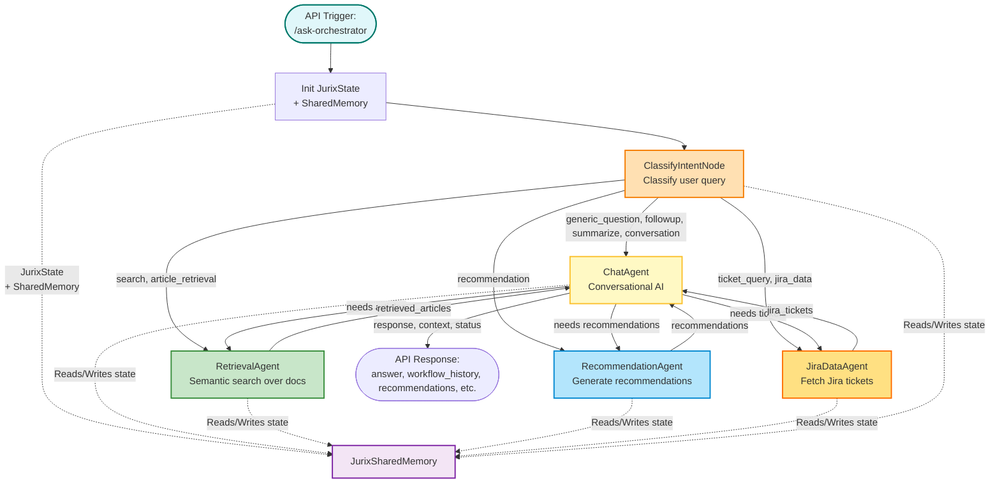
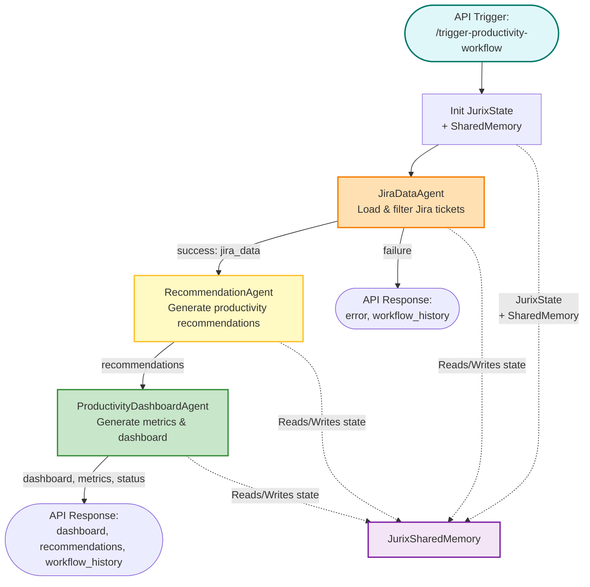
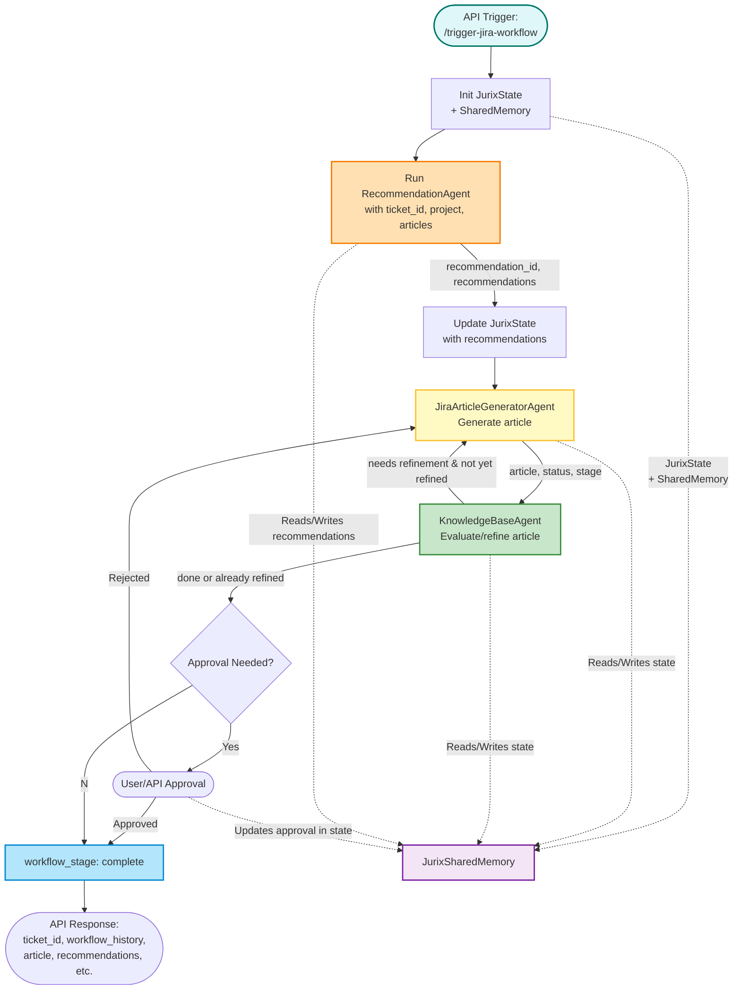

# JURIX Workflow Architecture

## Overview

JURIX is a modular orchestration system for Agile and software development support, integrating conversational AI, document retrieval, recommendation, and productivity analytics. The system is built around several specialized agents and workflows that interact to answer user queries, retrieve relevant documentation, generate recommendations, and analyze productivity data.

---

## Workflows

### 1. General Orchestration Workflow

Handles user queries, classifies intent, and routes to chat, retrieval, or recommendation agents.

### 2. Productivity Workflow

Analyzes Jira ticket data for a project and time range, generates recommendations, and produces a productivity dashboard.

### 3. Jira Article Generation Workflow

Automates the creation and refinement of Confluence-ready articles from Jira tickets, with quality evaluation and iterative refinement.

